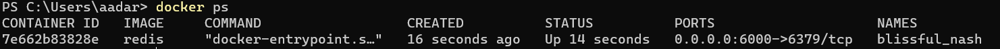
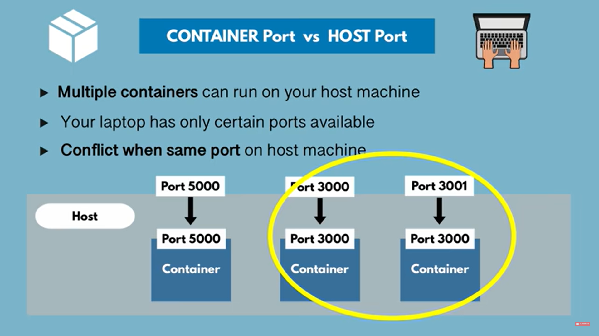

> 1.  docker images

It will list all the installed images

> 2.  docker run [imageName]

It will create a container for the specified image. It will start the image in a container (a proper application)

NOTE: CTRL+C will stop the running container, we can also run the image in _detached mode_ to prevent it from happening

> docker run -d [imageName]

It will run the image in detach mode

> 3.  docker ps

It will list all the running container

Notice, how the container has given its PORT number, which is the Container Port number NOT the Host(native machine) port number

> 4. docker ps -a

It will list all running and stopped containers

> 5.  docker stop [CONTAINER ID]

It will stop the container if running

> 6.  docker start [CONTAINER ID]

It will start the container

>7. docker run -p[HostPORT]:[ContainerPORT] [image]

It will bind the `container port` to `host port`

NOTE: we can see that 2 container port can be same, but internally the port it is binded to (the actual host port) is different (3000 and 3001 in our case)