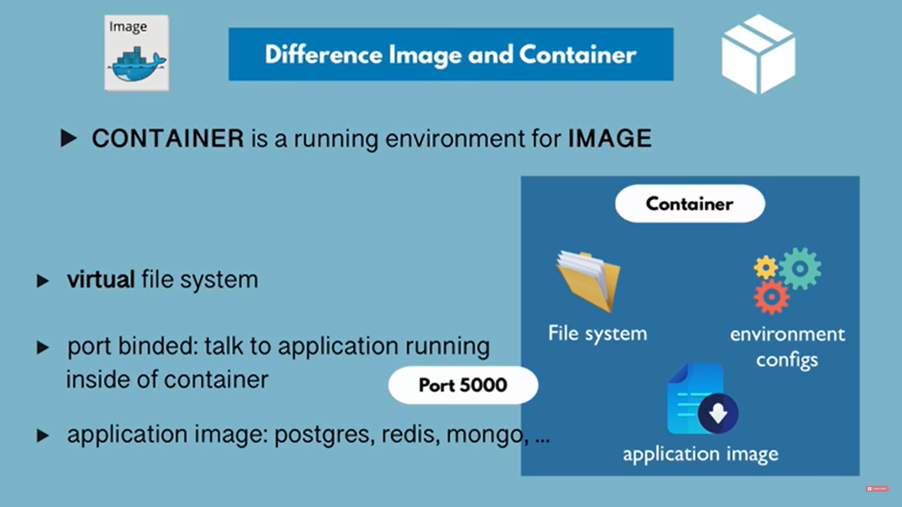

## 1. Docker Image  
A Docker image is a file used to execute code in a Docker container. Docker images act as a set of instructions to build a Docker container, like a template. Docker images also act as the starting point when using Docker. An image is comparable to a snapshot in virtual machine (VM) environments.

Docker is used to create, run and deploy applications in containers. A Docker image contains *application code, libraries, tools, dependencies and other files* needed to make an application run. When a user runs an image, it can become one or many instances of a container.

A Docker image is like a snapshot in other types of VM environments. It is a record of a Docker container at a specific point in time. Docker images are also immutable. While they can't be changed, they can be duplicated, shared or deleted. The feature is useful for testing new software or configurations because whatever happens, the image remains unchanged.

Docker images have multiple layers, each one originates from the previous layer but is different from it. The layers speed up Docker builds while increasing reusability and decreasing disk use. Image layers are also read-only files. Once a container is created, a writable layer is added on top of the unchangeable images, allowing a user to make changes.

## 2. Docker Container
A Docker container is a virtualized runtime environment which runs docker image
- Containers have its own virtual file system, where all the local environment variables, log files etc of any application can be stored
- Port is binded, which helps to talk to application running inside the container
