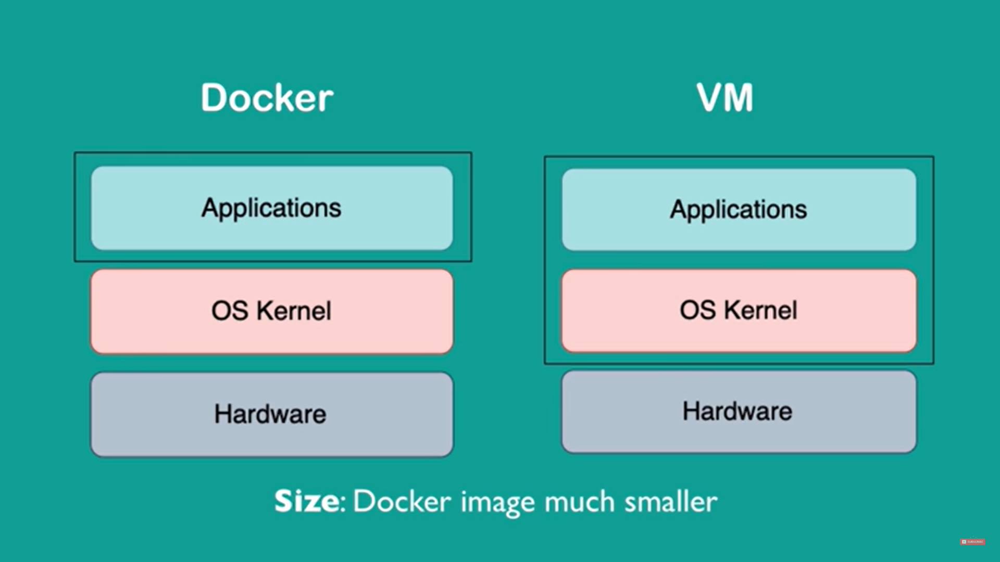

# Docker Vs Virtual Machine

- docker doesnot have its own OS kernel, and hence its size is much smaller and it boots up much faster
- VM comes with is own OS Kernel

**NOTE:** Linux based docker images will not work on Windows, as it is not compatible with windows kernel (We have **Docker Toolbox** which helps to overcome this problem)